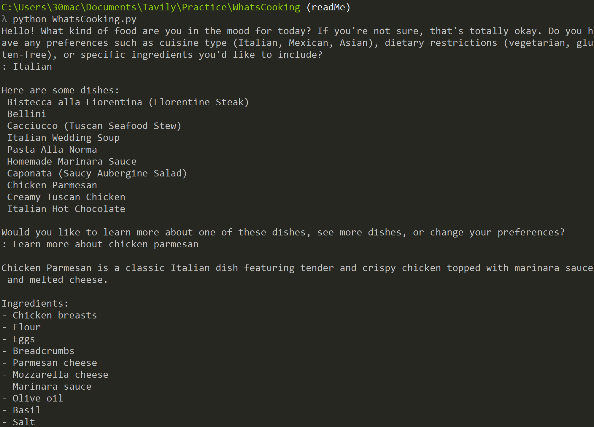
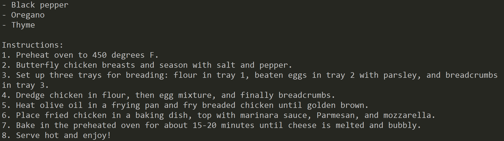

# What's Cooking

Have you ever desired to cook something new but you weren't sure what to cook? What's Cooking finds just the right food dish for you to try out. Powered by AI agents, What's Cooking scours the internet for recipes based on your preferences, or if you have none, suggests some recipes to you.

## Project Goals

The goal of this project is to learn state of the art AI development tools including LangGraph and Tavily. Working on a text based project like this is great to focus just on learning the ropes of these powerful tools. The next goal would be to integrate this project into a web application.

## Meet the Agents

What's Cooking is built up of nine LangGraph agents working together to give you the perfect recipe.

1. GREETER AGENT: Greets the user and gets their food preferences
2. DISH SEARCH AGENT: Searches the internet for relevant food dishes
3. LIST FORMER AGENT: Constructs a list of food dishes from the search
4. SHOW DISHES AGENT: Shows the list of food dishes with options to learn more about a dish, see more dishes, or change their food preferences
5. RESEARCH DISH AGENT: Searches the internet for information on a food dish
6. SHOW DISH AGENT: Shows a decsription, list of ingredients, and recipe for a food dish
7. LIST RETURN AGENT: Routes the user back to a previously shown list of food dishes
8. SEE MORE DISHES AGENT: Shows more relevant food dishes
9. CHANGE PREFERENCES AGENT: Gets the user's new food preferences if they want to change them

## Example Generation




## How to Install

### API Keys

An OpenAI API key and Tavily API key are required for this application. Click the links below to sign up:\
[OpenAI API Key](https://platform.openai.com/)\
[Tavily API Key](https://tavily.com/)

### Installing Project

1. First clone the repository
   ```
   git clone https://github.com/mmills2/WhatsCooking.git
   ```
2. Then set your API keys
   - Windows
   ```
   setx OPENAI_API_KEY = <your-openai-api-key>
   setx TAVILY_API_KEY = <your-tavily-api-key>
   ```
   - Linux/Unix
   ```
   export OPENAI_API_KEY = <your-openai-api-key>
   export TAVILY_API_KEY = <your-tavily-api-key>
   ```
   You may have to restart your terminal after setting the API keys for the set to take affect
3. Then install the requirements
   ```
   pip install -r requirements.txt
   ```
4. Lastly run the WhatsCooking.py file
   ```
   python WhatsCooking.py
   ```

## How to Contribute

1. Fork the repository from the master branch

2. Develop and test on your fork

3. Commit and push to your fork

4. Make a pull request to merge your fork in

Once you've made your pull request, it will be reviewed for merging.

## Architecture Notes

The application consists of a main executable file (WhatsCooking.py), an agents package, and supporting files (agent_state.py and structured_outputs.py). The main executable file compiles and executes the LangGraph. This LangGraph is made up of the agents defined in the agents package. The supporting files provide schemas used throughout the agent and graph logic.

### Agents

To add agents, create a new class in the agents package and make sure it inherits the agent parent class. Each agent should have an init method and run method. The run method is what will execute during graph execution. Each agent should be added to the init python file in the agents package. Each agent needs to be initialized, added as a node to the graph, and have edges added in the WhatsCooking file.

## API Usage

Currently, to reach the END node, the OpenAI API must be called a minimum of seven times and the Tavily API must be called twice. However, if the user gives invalid answers or uses the see more dishes and change preferences features, then both APIs will be called more times. Incorporating this project into an application with a GUI like a web application would reduce the number of API calls needed. The show dishes and list return agents are used for determining which node to route to next. They do this by processing the user's answer with AI as when using user text input, the text must be checked to be relevant. A GUI with buttons would circumvent the need for answer validation. For example, choosing to see more dishes could be done with the click of a see more button rather than invoking the AI to process the user's answer to see if they want to see more dishes. The Tavily API usage can be controlled directly within the settings.ini file. By setting the number of search queries for both search instances to one, the API will be called the minimum two times. However, allowing at least two to three queries typically results in better compiled outputs.
